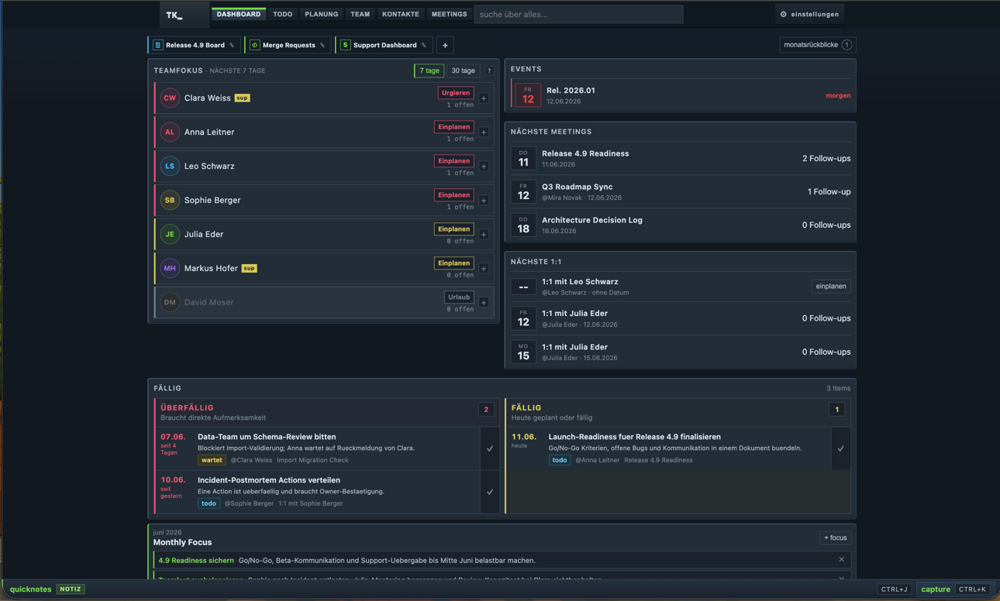
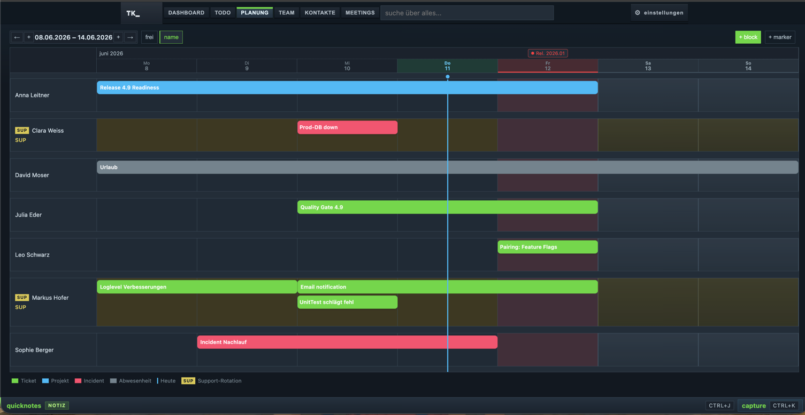
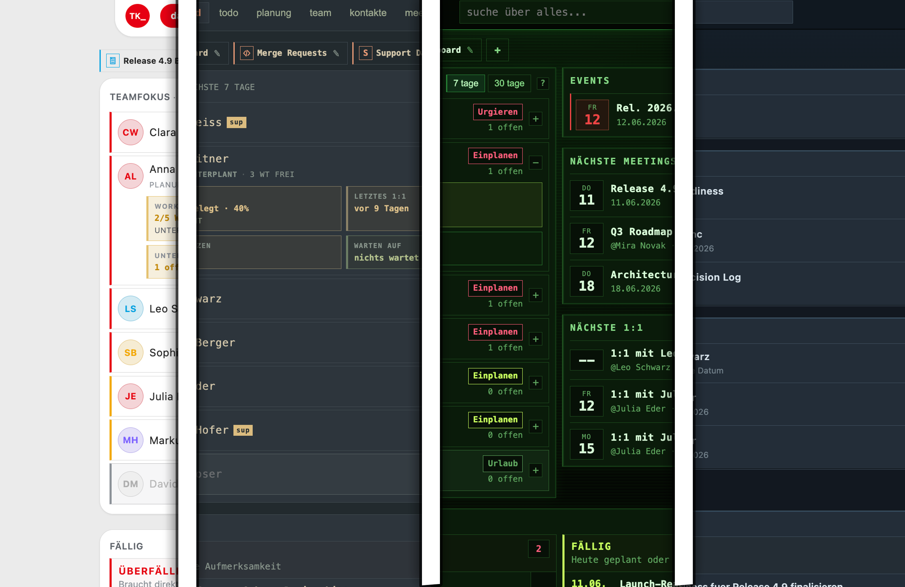

# TKTool

A personal team coordination tool for an engineering team lead. It tracks
todos, 1:1s, team meetings, capacity planning, and per-person growth signals
in one place. I built it for myself, use it daily, and open-sourced it because
it turned out more useful than expected — not because it wants to be a product.

The UI is in German. So is the data model in places (`werktage`, `allokiert`,
`supportMonate`). Historically grown, not going to change.

## Screenshots

*Screenshot of the Dashboard View*

*Screenshot of the Planner View*

*Various Themes for different Vibes*

## Core concepts

### One JSON file, your folder

All data lives in a single `tktool-data.json` in a directory *you* pick via
the File System Access API. The directory handle is persisted in IndexedDB,
so you pick once. No backend, no accounts, no cloud — put the folder in
whatever sync you already trust (or none). The reasoning: this is personal
data about real people; the least surprising storage model is a file the
user can see, diff, and delete.

### Backups and cleanup

Backups are byte copies of `tktool-data.json` written into a `backups/`
subfolder of the same directory — no second directory picker, nothing in the
Downloads folder. One is written automatically once a day (`lastBackupAt`
lives in the data file, so a second instance doesn't write its own). The
automatic one can be switched off in the settings menu; that flag lives in
the data file too, because it describes the folder ("this one gets backed
up"), not the machine you happen to be sitting at. Manual backups keep
working either way.

Pruning is per reason, because the three kinds are worth different things: 7
daily ones, 2 manual, 5 from cleanup runs. A backup is a full snapshot, not a
delta — restoring a month-old one costs a month of work, so for the daily
copies a short rolling window is enough. And since a copy is only written
when the app is opened, 7 of them span your last seven *active* days, not
seven calendar days. The cleanup backups are the only remaining copy of what
cleanup deleted, so daily copies must not push them out. The counts are kept
deliberately low: every copy is the size of the whole data file, so the
backup folder costs several times what cleanup ever frees.

Cleanup is *not* a disk-space feature, despite how it looks. The data file is
tens of kilobytes and would be a few hundred after a decade; the backup
folder alone costs more than cleanup will ever free. What it actually buys is
that finished work stops turning up in search, lists and exports — and that
every view keeps rendering off a small array.

It has a retention per category, because they age differently: done todos 4
months, planning blocks 3, markers 12, meetings 24, wins never (opt-in).
Notes, people, focuses and month reviews are never touched. Your choice is
remembered in the data file. A backup is always written first.

The content goes immediately; what survives is a ~140-byte tombstone so a
stale copy on another device can't resurrect the entry. Which is why the
data file also keeps a small device registry (`{id, label, lastSeenAt}` per
device, updated on load). Once every active device has loaded the file after
a deletion, its tombstone is provably in every local cache and gets dropped
automatically — with two machines that means "open the other one once". The
90-day grace period is only the fallback for devices that never come back; a
device unseen for 90 days is considered retired and stops blocking.

Deleting entries is *only* ever triggered from the cleanup dialog. What runs
on its own after a load is: the device check-in, dropping tombstones that
every device has confirmed, and the daily backup.

The registry pays for itself twice over: `changeId` already encodes the
writing device (`<deviceId>:<ts>:<seq>`), so a concurrent edit merged in from
the other machine can name its source ("Änderung von windows · a1b2
übernommen") instead of the anonymous "external change merged", and the
settings menu lists who shares the folder and when they last synced.

### Capacity blocks

Planning works in *blocks* (ticket, project, incident, absence) drawn on a
per-person timeline, created and resized by dragging. Capacity is computed,
never stored: workdays in the window minus allocated block days equals free
days. People can be flagged for support duty per month (`supportMonate`),
shown as a SUP badge. The deliberate choice here is workday granularity —
no hours, no story points. A team lead needs to see "who is free next week",
not run a resource-leveling algorithm.

### 1:1 carryover

When opening a 1:1, the tool computes what to talk about: open follow-ups
from earlier meetings, open todos assigned to the person, and growth signals
recorded since the *previous* 1:1 with that person. Nothing is copied or
stored — it's derived at render time from the items that already exist.
This is the feature the tool exists for: never walking into a 1:1 without
context, and never maintaining a separate "agenda" document that drifts.

### Growth signals

Highlights and concerns are logged per person as dated items. A rolling
30-day window aggregates them into a simple signal per team member, and
monthly reviews summarize them per month. The point is trend over incident:
one concern is a Tuesday, three in a month is a conversation.

### Sudo mode

Sensitive content — growth journal, personal notes, development direction —
is hidden behind a toggle (`Cmd/Ctrl+Shift+S`). This exists for exactly one
scenario: screen sharing. The rest of the tool is safe to project in a team
meeting; sudo mode keeps it that way.

## Design philosophy

Terminal brutalism, more or less: system monospace everywhere, amber accent,
near-zero border radius, lowercase labels, dense layouts. The reasoning is
function over decoration — the tool should feel like an instrument you
operate, not a SaaS landing page that happens to store data. There are
thirteen themes (dawn, daylight, naboo, matrix, …) because theming a
CSS-variable-based design is cheap and occasionally fun.

## Running it

Open in a Chromium-based browser. The File System Access API
(`showDirectoryPicker`) is not available in Firefox or Safari. No build
step, no dependencies, nothing to install.

On first launch you pick a data directory; `tktool-data.json` is created
there.

For the easiest download, use `TKTool.html` from the repository root. It contains
the app's HTML, CSS, and JavaScript in one file and is refreshed with each update i push.

## Architecture decisions

- **Vanilla JS, zero dependencies.** `index.html`, `styles.css` (plus one
  CSS file per theme), and one JS file per view/domain under `js/`, loaded
  as plain script tags in dependency order. No modules, no build — it works
  opened straight from the filesystem. Nothing to update, nothing that
  breaks in five years.
- **Full re-render on navigation.** Every view change rebuilds its DOM via
  `innerHTML`. At this data size (one team, one year) it's instant, and it
  removes an entire class of state-sync bugs.
- **Derived over stored.** Capacity, carryover, signals, and activity
  summaries are computed from raw items at render time. Stored aggregates
  go stale; computed ones don't.
- **Shared global scope across JS files.** The split into `js/data.js`,
  `js/helpers.js`, view files, and `js/ui.js` is for navigability, not
  encapsulation — everything is still global, and inline `onclick` handlers
  depend on that. Load order matters: data and helpers first, init last.
- **Keyboard-first capture.** `Ctrl+K` captures an item from anywhere,
  `Ctrl+J` toggles a free-form quicknotes drawer. Friction at capture time
  is the main reason tracking tools die.

## Non-goals

- Not a Jira/Linear replacement — no sprints, no estimates, no workflow.
- Not multi-tenant, not collaborative, no auth. One user, one file.
- Not mobile-first. It's used on a desktop, next to a calendar.
- Not configurable. Item types, block types, and views encode how I work;
  fork it if you work differently.
